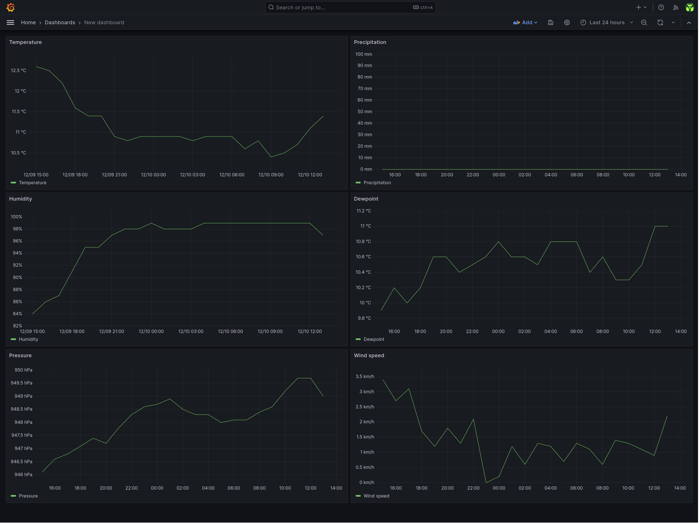

# aemet-exporter

CLI tool that uploads the last 24h weather conditions from the AEMET OpenData API to influxdb on a hourly basis

## Dependencies

- [go](https://go.dev/)
- [influxdb v2+](https://docs.influxdata.com/influxdb/v2.6/)
- Optional:
  - [make](https://www.gnu.org/software/make/) - for automatic installation support
  - [docker](https://docs.docker.com/)
  - [systemd](https://systemd.io/)

## Relevant documentation

- [AEMET OpenData API](https://opendata.aemet.es)
- [InfluxDB API](https://docs.influxdata.com/influxdb/v2.6/write-data/developer-tools/api/)
- [Systemd Timers](https://www.freedesktop.org/software/systemd/man/systemd.timer.html)
- [compose-scheduler](https://github.com/reddec/compose-scheduler)

## Installation

### With Docker

#### docker-compose

1. Configure `aemet_exporter.json` (see the configuration section below).
1. Run it.

   ```bash
   docker compose up --detach
   ```

#### docker build & run

1. Build the docker image.

   ```bash
   docker build . --tag aemet-exporter
   ```

1. Configure `aemet_exporter.json` (see the configuration section below).
1. Run it.

   ```bash
    docker run --rm --init --tty --interactive --read-only --cap-drop ALL --security-opt no-new-privileges:true --cpus 2 -m 64m --pids-limit 16 --volume ./aemet_exporter.json:/app/aemet_exporter.json:ro ghcr.io/rare-magma/aemet-exporter:latest
    ```

### With the Makefile

For convenience, you can install this exporter with the following command or follow the manual process described in the next paragraph.

```bash
make build
make install
$EDITOR $HOME/.config/aemet_exporter.json
```

### Manually

1. Build `aemet_exporter` with:

   ```bash
   go build -ldflags="-s -w" -o aemet_exporter main.go
   ```

2. Copy `aemet_exporter` to `$HOME/.local/bin/`.

3. Copy `aemet_exporter.json` to `$HOME/.config/`, configure it (see the configuration section below) and make it read only.

4. Copy the systemd unit and timer to `$HOME/.config/systemd/user/`:

   ```bash
   cp aemet-exporter.* $HOME/.config/systemd/user/
   ```

5. and run the following command to activate the timer:

   ```bash
   systemctl --user enable --now aemet-exporter.timer
   ```

It's possible to trigger the execution by running manually:

```bash
systemctl --user start aemet-exporter.service
```

### Config file

The config file has a few options:

```json
{
 "InfluxDBHost": "influxdb.example.com",
 "InfluxDBApiToken": "ZXhhbXBsZXRva2VuZXhhcXdzZGFzZGptcW9kcXdvZGptcXdvZHF3b2RqbXF3ZHFhc2RhCg==",
 "Org": "home",
 "Bucket": "aemet",
 "AemetApiKey": "ZXhhbXBsZXRva2VuZXhhcXdzZGFzZGptcW9kcXdvZGptcXdvZHF3b2RqbXF3ZHFhc2RhCg==",
 "AemetWeatherStationCode": "1234Y"
}
```

- `InfluxDBHost` should be the FQDN of the influxdb server.
- `Org` should be the name of the influxdb organization that contains the data bucket defined below.
- `Bucket` should be the name of the influxdb bucket that will hold the data.
- `InfluxDBApiToken` should be the influxdb API token value.
  - This token should have write access to the `Bucket` defined above.
- `AemetApiKey` should be the AEMET API key requested in the AEMET OpenData's [website](https://opendata.aemet.es/centrodedescargas/altaUsuario?)
- `AemetWeatherStationCode` should be the alphanumeric code assigned to the weather station. Can be found in AEMET OpenData's [website](https://opendata.aemet.es/centrodedescargas/productosAEMET?) "Seleccione una estación" dropdown.

## Troubleshooting

Run the tool manually with go set to debug:

```bash
GODEBUG=http1debug=2 $HOME/.local/bin/aemet_exporter
```

Check the systemd service logs and timer info with:

```bash
journalctl --user --unit aemet-exporter.service
systemctl --user list-timers
```

## Exported metrics for each hour

Weather stations might have a different set of sensors so not all metrics below might be populated.

- temperature: `°C`
- humidity: `%`
- pressure: `hPa`
- windspeed: `km/h`
- windgust: `km/h`
- winddirection: `°`
- precipitation: `mm`
- dewpoint: `°C`
- visibility: `km`
- insolation: `hours`
- snow: `cm`

## Exported metrics example

```bash
aemet_weather_conditions,station=3195 temperature=11.1,humidity=99.0,pressure=949.7,windspeed=0.9,winddirection=271.0,windgust=2.9,precipitation=0.0,dewpoint=11.0,visibility=1.0,insolation=1.0,snow=0.0 1702206000
```

## Example grafana dashboard

In `aemet-dashboard.json` there is an example of the kind of dashboard that can be built with `aemet-exporter` data:



Import it by doing the following:

1. Create a dashboard
2. Click the dashboard's settings button on the top right.
3. Go to JSON Model and then paste there the content of the `aemet-dashboard.json` file.

## Uninstallation

### With the Makefile

For convenience, you can uninstall this exporter with the following command or follow the process described in the next paragraph.

```bash
make uninstall
```

### Manually

Run the following command to deactivate the timer:

```bash
systemctl --user disable --now aemet-exporter.timer
```

Delete the following files:

```bash
~/.local/bin/aemet_exporter
~/.config/aemet_exporter.json
~/.config/systemd/user/aemet-exporter.timer
~/.config/systemd/user/aemet-exporter.service
```

## Credits

Información elaborada por la Agencia Estatal de Meteorología © AEMET

- [reddec/compose-scheduler](https://github.com/reddec/compose-scheduler)
